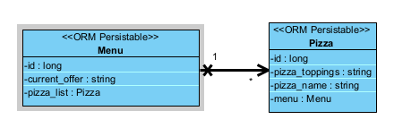

# Pizzeria Reference Project (PizzaRP)

This is a minimal Pizzeria Reference Project (PizzaRP) as a template for students. 

[](http://www.apache.org/licenses/LICENSE-2.0.html)

> 🚧: **This is a template project**: Make sure you adapt this documentation and the source code in this project according to your needs and use case. Comments are provided with "🚧:". Do not leave these comments in your final submission!

#### Contents:
- [Analysis](#analysis)
  - [Scenario](#scenario)
  - [User Stories](#user-stories)
  - [Use Case](#use-case)
- [Design](#design)
  - [Prototype Design](#prototype-design)
  - [Domain Design](#domain-design)
  - [Business Logic](#business-logic)
- [Implementation](#implementation)
  - [Backend Technology](#backend-technology)
  - [Frontend Technology](#frontend-technology)
- [Project Management](#project-management)
  - [Roles](#roles)
  - [Milestones](#milestones)

## Analysis
> 🚧: You can reuse the analysis (you made) from other projects (e.g., requirement engineering), but it must be submitted according to the following template. 


### Scenario

PizzaRP (Pizzeria Reference Project) is the smallest possible and lightweight demonstration tool allowing the pizzaiolo (Role: Admin) to manage its pizza catalog. 

### User Stories
1.	As an Admin, I want to have a Web app to use on different mobile devices and desktop computers.
2.	As an Admin, I want to see a consistent visual appearance to navigate easily, and it should looks consistent.
3.	As an Admin, I want to use list views to explore and read my business data.
4.	As an Admin, I want to use edit and create views to maintain my business data.

### Use Case


- UC-1 [Show all the Pizza]: Admin can retrieve all the pizza on the menu
- UC-2 [Show a Pizza]: Admin can retrieve the information on a specific pizza.
- UC-3 [Edit a Pizza]: Admin can create, update, and delete pizzas from the menu.
- UC-4 [Show Current Location Offer]: Admin can retrieve the special offers based on different locations -->

## Design
> 🚧: Keep in mind the Corporate Identity (CI); you shall decide appropriately the color schema, graphics, typography, layout, User Experience (UX), and so on.

### Wireframe
> 🚧: It is suggested to start with a wireframe. The wireframe focuses on the website structure (Sitemap planning), sketching the pages using Wireframe components (e.g., header, menu, footer) and UX. You can create a wireframe already with draw.io or similar tools. 

Starting from the home page, we can visit different pages. Available public pages are visible in the menu. On the homepage, a banner suggest visiting the special offers and the seasonal menu.

### Prototype
> 🚧: A prototype can be designed using placeholder text/figures in Budibase. You don't need to connect the front-end to back-end in the early stages of the project development.

### Domain Design
> 🚧: Provide a picture and describe your domain model; you may use Entity-Relationship Model or UML class diagram. Both can be created in Visual Paradigm - we have an academic license for it.

The `ch.fhnw.pizza.data.domain` package contains the following domain objects / entities including getters and setters:



### Business Logic 
> 🚧: Describe the business logic for **at least one business service** in detail. If available, show the expected path and HTPP method. The remaining documentation of APIs shall be made available in the swagger endpoint.

Based on the UC-4, there will be two offers and a standard offer. Given a location, a message is shown accordingly:

- If the location is "Basel", the message is "10% off on all large pizzas!!!"
- If the location is "Brugg", the message is "two for the price of One on all small pizzas!!!"
- Otherwise, the message is "No special offer".

**Path**: [`/api/pizza`](/api/pizza) 

**Param**: `value="location"`

**Method:** `GET`

## Implementation
> 🚧: Briefly describe your technology stack, which apps were used and for what.

### Backend Technology
> 🚧: It is suggested to clone this repository, but you are free to start from fresh with a Spring Initializr. If so, describe if there are any changes to the PizzaRP e.g., different dependencies, versions & etc... Please, also describe how your database is set up. If you want a persistent or in-memory H2 database check [link](https://github.com/FHNW-INT/Pizzeria_Reference_Project/blob/main/pizza/src/main/resources/application.properties). If you have placeholder data to initialize at the app, you may use a variation of the method **initPlaceholderData()** available at [link](https://github.com/FHNW-INT/Pizzeria_Reference_Project/blob/main/pizza/src/main/java/ch/fhnw/pizza/PizzaApplication.java).

This Web application is relying on [Spring Boot](https://projects.spring.io/spring-boot) and the following dependencies:

- [Spring Boot](https://projects.spring.io/spring-boot)
- [Spring Data](https://projects.spring.io/spring-data)
- [Java Persistence API (JPA)](http://www.oracle.com/technetwork/java/javaee/tech/persistence-jsp-140049.html)
- [H2 Database Engine](https://www.h2database.com)

To bootstrap the application, the [Spring Initializr](https://start.spring.io/) has been used.

Then, the following further dependencies have been added to the project `pom.xml`:

- DB:
```XML
<dependency>
			<groupId>com.h2database</groupId>
			<artifactId>h2</artifactId>
			<scope>runtime</scope>
</dependency>
```

### Frontend Technology
> 🚧: Describe your views and what APIs is used on which view.

This Web application was developed using Budibase and it is available for preview at https://inttech.budibase.app/app/pizzeria. 

## Deployment
> 🚧: Please set your codespace with a public port. See the guide at [link](https://docs.github.com/en/codespaces/developing-in-a-codespace/forwarding-ports-in-your-codespace).


## Project Management
> 🚧: Include all the participants and briefly describe each of their **individual** contribution and/or roles. Screenshots/descriptions of your Kanban board or similar project management tools are welcome.

### Roles
- Back-end developer: Charuta Pande 
- Front-end developer: Devid Montecchiari

### Milestones
1. **Analysis**: Scenario ideation, use case analysis and user story writing.
2. **Prototype Design**: Creation of wireframe and prototype.
3. **Domain Design**: Definition of domain model.
4. **Business Logic and API Design**: Definition of business logic and API.
5. **Data and API Implementation**: Implementation of data access and business logic layers, and API.
<!-- 
6. (optional) **Security and Frontend Implementation**: Integration of security framework and frontend realisation.
7. (optional) **Deployment**: Deployment of Web application on cloud infrastructure.
 -->

#### Maintainer
- Charuta Pande
- Devid Montecchiari

#### License
- [Apache License, Version 2.0](blob/master/LICENSE)
