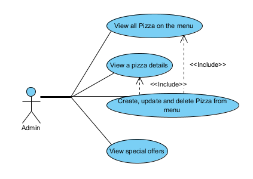
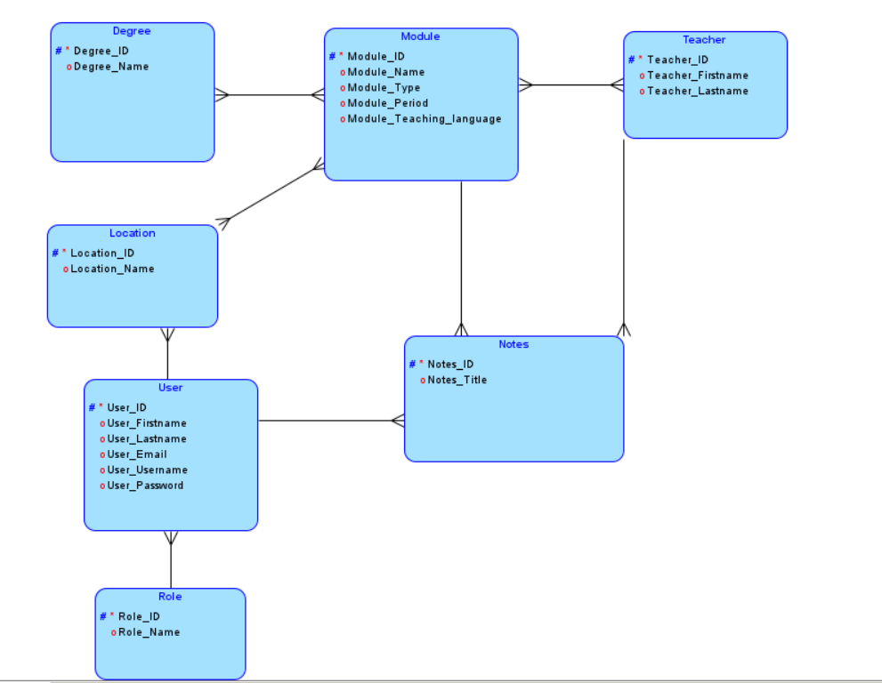

# Lecture Note Sharing Hub Project

The Lecture Note Sharing Hub is a web application designed for the FHNW students to conveniently find and share lecture notes.  
 
It features a comprehensive filtering system that allows students to sort notes by various criteria including module, location, and lecturer.  
 
Users can upload their notes, manage their content, and easily navigate the platform to access the information they need, tailored to their educational requirements. The app supports secure user authentication for students and admins, ensuring a safe exchange of information.

[](http://www.apache.org/licenses/LICENSE-2.0.html)

> 🚧: **This is a template project**: Make sure you adapt this documentation and the source code in this project according to your needs and use case. Comments are provided with "🚧:". Do not leave these comments in your final submission!

#### Contents:
- [Analysis](#analysis)
  - [Scenario](#scenario)
  - [User Stories](#user-stories)
  - [Use Case](#use-case)
- [Design](#design)
  - [Prototype Design](#prototype-design)
  - [Domain Design](#domain-design)
  - [Business Logic](#business-logic)
- [Implementation](#implementation)
  - [Backend Technology](#backend-technology)
  - [Frontend Technology](#frontend-technology)
- [Project Management](#project-management)
  - [Roles](#roles)
  - [Milestones](#milestones)

## Analysis
> 🚧: You can reuse the analysis (you made) from other projects (e.g., requirement engineering), but it must be submitted according to the following template. 


### Scenario

The Lecture Note Sharing Hub is a web application designed for the FHNW students to conveniently find and share lecture notes.  

### User Stories
User: 
1. As a User I want to have a website that is easily accessible  
2. As a User I want to have a website that is mobile friendly. 
3. As a User I want to I want to have a user account so I can authenticate myself. 
5. As a User I want to delete my user account 
6. As a User I want to have the oppurtunity to change my password or E-Mail  
7. As a User I want to upload my notes for a specific module.  
8. As a User I want to delete my notes for a specific module if I don’t want to share then anymore.  
9. As a User I want to download notes that are necessary for my specific module. 
11. As a User I want to favourise notes so I can (and see how many favs)
13. As a User, I want to search for notes by keywords, so I can find relevant information quickly. 
14. As a User, I want to filter notes by module, date, location and lecturer, so I can easily find the most relevant notes.

Admin: 

15. As an Admin, I want to delete an account. 
16. As an Admin, I want to delete notes. 
17. As an Admin, I want to add and delete a module.

### Use Case




- UC-1 [Show all the Pizza]: Admin can retrieve all the pizza on the menu
- UC-2 [Show a Pizza]: Admin can retrieve the information on a specific pizza.
- UC-3 [Edit a Pizza]: Admin can create, update, and delete pizzas from the menu.
- UC-4 [Show Current Location Offer]: User can retrieve special menu by location

## Design
> 🚧: Keep in mind the Corporate Identity (CI); you shall decide appropriately the color schema, graphics, typography, layout, User Experience (UX), and so on.

### Wireframe
> 🚧: It is suggested to start with a wireframe. The wireframe focuses on the website structure (Sitemap planning), sketching the pages using Wireframe components (e.g., header, menu, footer) and UX. You can create a wireframe already with draw.io or similar tools. 

Starting from the home page, we can visit different pages. Available public pages are visible in the menu...

### Prototype
> 🚧: A prototype can be designed using placeholder text/figures in Budibase. You don't need to connect the front-end to back-end in the early stages of the project development.

### Domain Design
> 🚧: Provide a picture and describe your domain model; you may use Entity-Relationship Model or UML class diagram. Both can be created in Visual Paradigm - we have an academic license for it.

The `ch.fhnw.pizza.data.domain` package contains the following domain objects / entities including getters and setters:



### Business Logic 
> 🚧: Describe the business logic for **at least one business service** in detail. If available, show the expected path and HTPP method. The remaining documentation of APIs shall be made available in the swagger endpoint. The default Swagger UI page is available at /swagger-ui.html.

Based on UC-3, the users can search notes by title and filter them by module or location. If no notes are found, notes from other years will be displayed as alternatives. 

Possible path: /api/notes/?q=summary&module=math2&location=basel&date=2024&semester=fs&sort=pop
Params: 
Values
value=”q” Admitted values: Any
value=”module” Admitted values: Module list
value=”location” Admitted values: "basel”,”brugg”,”olten”, “muttenz”
value=”date” Admitted values: Year
value=”semester” Admitted values: “fs”, “hs”
value=”sort” Admitted values: “mod”, “dat”, “pop” 
Method=GET
`

## Implementation
> 🚧: Briefly describe your technology stack, which apps were used and for what.

### Backend Technology
> 🚧: It is suggested to clone this repository, but you are free to start from fresh with a Spring Initializr. If so, describe if there are any changes to the PizzaRP e.g., different dependencies, versions & etc... Please, also describe how your database is set up. If you want a persistent or in-memory H2 database check [link](https://github.com/FHNW-INT/Pizzeria_Reference_Project/blob/main/pizza/src/main/resources/application.properties). If you have placeholder data to initialize at the app, you may use a variation of the method **initPlaceholderData()** available at [link](https://github.com/FHNW-INT/Pizzeria_Reference_Project/blob/main/pizza/src/main/java/ch/fhnw/pizza/PizzaApplication.java).

This Web application is relying on [Spring Boot](https://projects.spring.io/spring-boot) and the following dependencies:

- [Spring Boot](https://projects.spring.io/spring-boot)
- [Spring Data](https://projects.spring.io/spring-data)
- [Java Persistence API (JPA)](http://www.oracle.com/technetwork/java/javaee/tech/persistence-jsp-140049.html)
- [H2 Database Engine](https://www.h2database.com)

To bootstrap the application, the [Spring Initializr](https://start.spring.io/) has been used.

Then, the following further dependencies have been added to the project `pom.xml`:

- DB:
```XML
<dependency>
			<groupId>com.h2database</groupId>
			<artifactId>h2</artifactId>
			<scope>runtime</scope>
</dependency>
```

- SWAGGER:
```XML
   <dependency>
      <groupId>org.springdoc</groupId>
      <artifactId>springdoc-openapi-starter-webmvc-ui</artifactId>
      <version>2.3.0</version>
   </dependency>
```

### Frontend Technology
> 🚧: Describe your views and what APIs is used on which view. If you don't have access to the Internet Technology class Budibase environment(https://inttech.budibase.app/), please write to Devid on MS teams.

This Web application was developed using Budibase and it is available for preview at https://inttech.budibase.app/app/pizzeria. 

## Execution
> 🚧: Please describe how to execute your app and what configurations must be changed to run it. 

The codespace URL of this Repo is subject to change. Therefore, the Budibase PizzaRP webapp is not going to show any data in the view, when the URL is not updated or the codespace is offline. Follow these steps to start the webservice and reconnect the webapp to the new webservice url. 

> 🚧: This is a shortened description for example purposes. A complete tutorial will be provided in a dedicated lecture.

1. Clone PizzaRP in a new repository.
2. Start your codespace (see video guide at: [link](https://www.youtube.com/watch?v=_W9B7qc9lVc&ab_channel=GitHub))
3. Run the PizzaRP main available at PizzaApplication.java on your own codespace.
4. Set your app with a public port, see the guide at [link](https://docs.github.com/en/codespaces/developing-in-a-codespace/forwarding-ports-in-your-codespace).
5. Create an own Budibase app, you can export/import the existing Pizzeria app. Guide available at [link](https://docs.budibase.com/docs/export-and-import-apps).
6. Update the pizzeria URL in the datasource and publish your app.

## Project Management
> 🚧: Include all the participants and briefly describe each of their **individual** contribution and/or roles. Screenshots/descriptions of your Kanban board or similar project management tools are welcome.

### Roles
- Back-end developer: Charuta Pande 
- Front-end developer: Devid Montecchiari

### Milestones
1. **Analysis**: Scenario ideation, use case analysis and user story writing.
2. **Prototype Design**: Creation of wireframe and prototype.
3. **Domain Design**: Definition of domain model.
4. **Business Logic and API Design**: Definition of business logic and API.
5. **Data and API Implementation**: Implementation of data access and business logic layers, and API.
6. **Security and Frontend Implementation**: Integration of security framework and frontend realisation.
7. (optional) **Deployment**: Deployment of Web application on cloud infrastructure.


#### Maintainer
- Charuta Pande
- Devid Montecchiari

#### License
- [Apache License, Version 2.0](blob/master/LICENSE)
